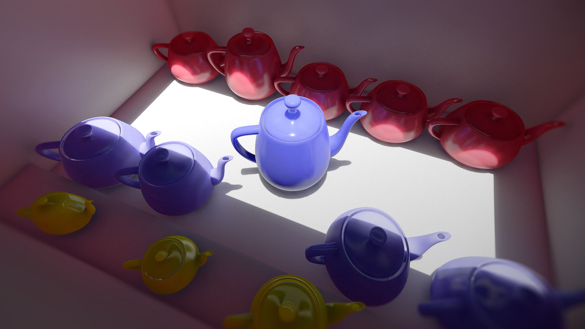

# voxelgen



(WIP - non-functional yet)

Stand-alone GPU-based triangle mesh voxelizer with light injection. Useful when precomputing data for voxel-based global illumination. Used in Armory, written in Haxe and Kha.

## Run

Takes `mesh.obj` file and outputs raw 64x64x64 volume of bytes into `out.bin`. This volume can be loaded into a 3D texture using RGBA8 format (or RGBA16/RGBA32 for HDR out).

```
git clone https://github.com/armory3d/voxelgen
cd voxelgen/build/krom
```

Windows
```
./run_windows.bat
```

Linux
```
./run_linux.sh
```

MacOS
```
./run_macos.sh
```

## Build

[Node](https://nodejs.org) and [Git](https://git-scm.com) required.

1. Recursive clone

```
git clone --recursive https://github.com/armory3d/voxelgen
cd voxelgen
git submodule foreach --recursive git pull origin master
git pull origin master
```

2. a) Compile Krom
```
node Kha/make krom
```

2. b) Compile C++
```
node Kha/make --compile
```

## References

This tool builds upon the works kindly shared in:
- http://www.seas.upenn.edu/%7Epcozzi/OpenGLInsights/OpenGLInsights-SparseVoxelization.pdf
- https://research.nvidia.com/sites/default/files/publications/GIVoxels-pg2011-authors.pdf
- https://github.com/Friduric/voxel-cone-tracing
- https://github.com/Cigg/Voxel-Cone-Tracing
- https://github.com/GreatBlambo/voxel_cone_tracing/
- http://simonstechblog.blogspot.com/2013/01/implementing-voxel-cone-tracing.html
- http://leifnode.com/2015/05/voxel-cone-traced-global-illumination/

## Tech

- [Iron](https://github.com/armory3d/iron)
- [Kha](https://github.com/Kode/Kha)
- [Krom](https://github.com/Kode/Krom)
- [Haxe](https://github.com/HaxeFoundation/haxe)

